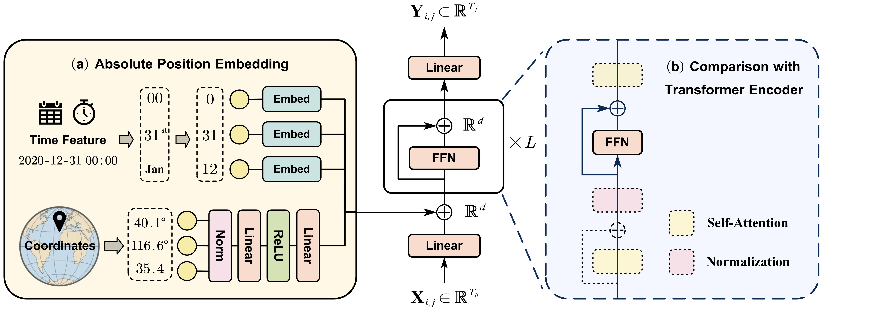
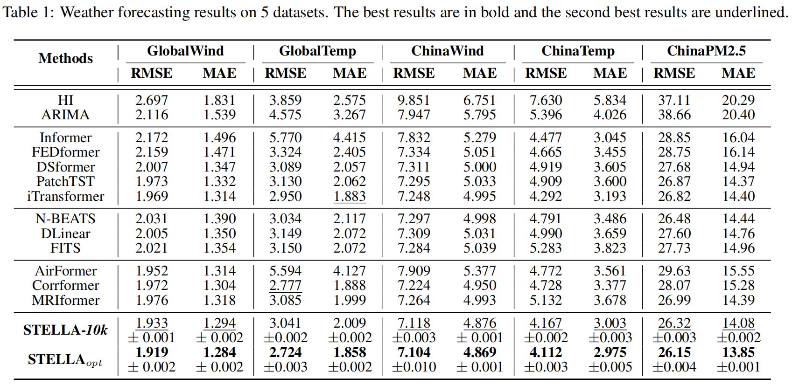

# <div align="center"> 🌠STELLA: Spatial-Temporal Embedded Lightweight Model for Atmospheric Time Series Forecasting</div>

Official code for the paper: On the Integration of Spatial-Temporal Knowledge: A Lightweight Approach to Atmospheric Time Series Forecasting



The code is developed with BasicTS, a PyTorch-based benchmark and toolbox for time series forecasting.

## 📚 Table of Contents

```text
basicts         --> The BasicTS, which provides standard pipelines for training MTS forecasting models. Don't worry if you don't know it, because it doesn't prevent you from understanding STELLA's code.

baselines       --> The implementation and settings of the baselines.

datasets        --> Raw data and preprocessed datasets.

scripts         --> Data preprocessing scripts.

stella	        --> The implementation of STELLA (settings are at `baselines/STELLA`).

checkpoints     --> training checkpoints.
```

## 💿 Requirements

The code is built based on Python 3.9, PyTorch 1.10.0, and EasyTorch.
You can install PyTorch following the instruction in [PyTorch](https://pytorch.org/get-started/locally/). For example:

```bash
pip install torch==1.10.0+cu111 torchvision==0.11.0+cu111 torchaudio==0.10.0 -f https://download.pytorch.org/whl/torch_stable.html
```

After ensuring that PyTorch is installed correctly, you can install other dependencies via:

```bash
pip install -r requirements.txt
```

## 📦 Data Preparation

### **Raw Data**

We provide two national datasets: **ChinaWind** and **ChinaTemp** as demos. You can download other datasets at [[Google Drive]](https://drive.google.com/file/d/1OS0xqDEZRsx9o3paEWCZXSIaUYKFLANN/view?usp=sharing).

The `datasets` directory contains the raw data and positional information of the datasets:

```text
datasets
   ├─ChinaWind
   |    ├─pos_data.npy // positional information
   ├─ChinaTemp
   |    ├─pos_data.npy // positional information
   ├─(Other datasets...)
   ├─raw_data
   |    ├─ChinaWind
   |    	├─ChinaWind.csv // raw data		
   |    ├─ChinaTemp
   |    	├─ChinaTemp.csv // raw data
   |    ├─(Other raw datasets...)
```

**Pre-process Data**

You can pre-process all data via:

```bash
cd /path/to/your/project
bash scripts/data_preparation/all.sh
```

Then the processed data will be in `datasets/ChinaWind` and `datasets/ChinaTemp`.

## <span id="jump"> 🎯 Train STELLA</span>

```bash
python train.py --cfg='STELLA/STELLA_$DATASET$.py' --gpus='0'
```

Please replace `$DATASET_NAME$` with `ChinaWind` ，`ChinaTemp`，or other dataset.
Configuration file `baselines/STELLA/STELLA_$DATASET$.py` describes the forecasting configurations.
It takes about 2 minutes of training time for each dataset on a single NVIDIA GeForce RTX 3090 GPU. You can edit `BATCH_SIZE` and `GPU_NUM` in the configuration file and `--gpu` in the command line to run on your own hardware.
The training logs and parameters of the best model are saved in `checkpoints`.

## 🏆 Result


